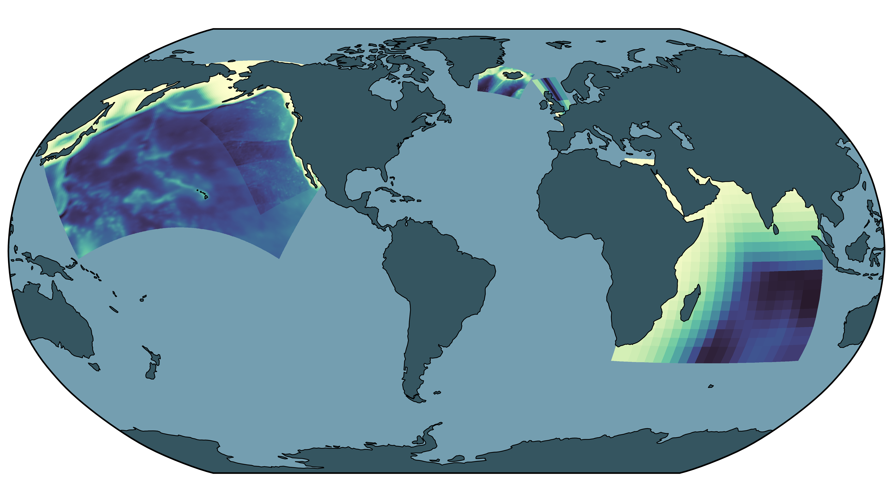

.. _forge-index:

Domain generation (Forge)
==========================

C-Star is built on a system of **applications** (a model or computation you want to
run) and **blueprints** (the inputs to an application that make its result
reproducible). **Forge** is the built-in application for *creating* new ROMS-MARBL
domains.

Setting up a regional ocean simulation has traditionally meant weeks of bespoke
work: designing a grid, collecting and regridding forcing datasets, hand-editing
model configuration files, and hoping the result is reproducible on the next
machine. Forge automates that path for ROMS-MARBL domains. You describe *what*
you want -- a region, a resolution, a time window, forcing sources -- and Forge
produces everything the model needs to run, in a form that C-Star can build and
execute anywhere.

The whole workflow revolves around two YAML documents:

- A **forge blueprint** describes the domain you want. It is the single input to
  Forge, and it is complete: given the same forge blueprint, Forge generates the
  same setup.
- A **ROMS-MARBL blueprint** (see :doc:`../blueprints`) describes the setup Forge
  generated -- the model code, input files, and runtime settings of a concrete,
  runnable simulation. It is Forge's output, and C-Star's input.

How it works
-------------

Forge takes you from "I want a regional ROMS-MARBL domain here" to a running
simulation in three conceptual steps:

1. **Build a forge blueprint.** An interactive **wizard** -- a point-and-click
   web form, also usable inside Jupyter -- walks you through the choices: a model
   spec, a domain from the bundled catalog (or your own), forcing sources,
   output settings. The result is saved as a single ``forge_blueprint.yaml``.
   Because the wizard is just a front-end for writing this file, you can also
   start from an example blueprint and edit it by hand.

2. **Process the blueprint.** The Forge executor consumes the forge blueprint
   on the machine where the data should live. It fetches and prepares the
   source datasets, generates every ROMS input file (grid, initial conditions,
   surface and boundary forcing, rivers, tides), renders the model settings,
   and emits the ROMS-MARBL blueprint describing the finished setup.

3. **Run the simulation.** C-Star consumes the ROMS-MARBL blueprint to fetch
   and compile the model code and execute the simulation -- on your laptop or on
   a supported HPC system. Forge is out of the picture at this point: the
   handoff is the blueprint file alone.

The input files are generated with `ROMS Tools <https://roms-tools.readthedocs.io/en/latest/index.html>`__,
drawing on GLORYS (ocean reanalysis), ERA5 (atmospheric reanalysis), UNIFIED_BGC
(biogeochemical climatology), SRTM15 (bathymetry), DAI/GLOFAS (river discharge),
and TPXO (tides).

Each step can happen on a different machine. A common pattern is building the
blueprint in a browser on your laptop, processing it on the cluster where the
forcing data lives, and running the simulation through C-Star's scheduler
support on that same cluster.

Install
-------

Forge ships as part of ``cstar-ocean`` -- there is no separate package to
install. Install ``cstar-ocean`` as described in :doc:`../installation`, then
verify Forge is available:

.. code-block:: console

   cstar --version
   cstar forge --help

Getting started
----------------

:doc:`getting_started` takes you from an installed environment to a running toy
simulation: registering for GLORYS and TPXO data access, building a forge
blueprint with the wizard, processing it, and running the result with C-Star.
For HPC installs and source checkouts see :doc:`installation_hpc`.

Next steps
-----------

- Follow :doc:`getting_started` for the wio-toy walkthrough.
- Browse the bundled **domain catalog** (:doc:`catalog`) in the wizard, or
  customize a domain's grid parameters.
- See :doc:`reference` for the forge blueprint and model spec schemas, and
  :doc:`internals` for the developer-facing architecture guide.
