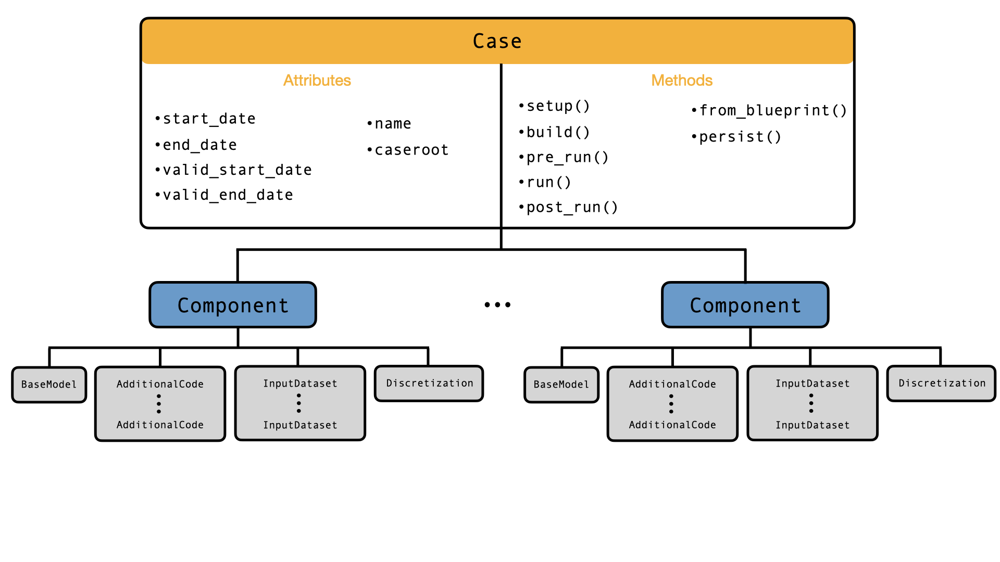

```{include} disclaimer.md
```

# Terminology

*Below is a glossary of key terms.*

```{glossary}
Case
  The primary object of `C-Star`. It contains all the necessary information for a user to run a reproducible Earth system simulation. A `Case` is built from {term}`component <Component>` objects, each representing a specific configuration of a model of one part of the overall system being simulated.

blueprint
  An on-disk representation of a {term}`Case <Case>`, stored in a `yaml` file. A `Case` can be exported to, or created from, a blueprint file. 

Component
  An object that consists of, at least, a {term}`base model <Base Model>`, and optionally {term}`additional code <Additional Code>`, {term}`input datasets <Input Dataset>`, and {term}`discretization <Discretization>` information needed to run the {term}`base model <Base Model>` in the specific configuration in question.

Base Model
  An object that describes the “off-the-shelf” model underlying a {term}`component <Component>`. It does not contain any information relative to the specific domain, forcing, code modifications, or combination of parameters with which the model will be run in our particular use case. Typically it will simply point (using the `source_repo` attribute) to the repository in which a development team hosts a model, and features a `checkout_target` attribute instructing `C-Star` on which version of this source code to use.

Additional Code
  An object that describes code associated with the {term}`base model <Base Model>`, this time containing code that is necessary to run the base model in a particular configuration of interest. This may include runtime namelist files specifying parameter values and paths to input data, or compile-time option files or source-code modifications. This is effectively code that would not normally be included with a model, but may be required in order to run it.

Input Dataset
  An object that describes any non-plaintext file needed to run our {term}`base model <Base Model>` in a particular configuration. These are typically netCDF files describing the domain, initial conditions, surface and boundary forcing necessary for a particular simulation using the base model.

Discretization
  An object that contains any information related to the discretization of a {term}`component <Component>`, such as time step and CPU distribution.
```


# Structure of C-Star Case




