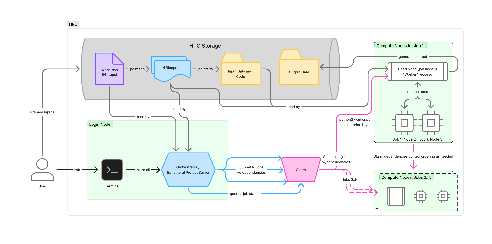

Terminology and Concepts
========================

Definitions
-----------
.. glossary::

    Application
      An **application** is a piece of software we want to run.

      Currently, the only supported application is `ROMS-MARBL`. Future applications
      will support domain generation and post-processing.

    Blueprint
     A **blueprint** contains all of the information needed to run a specific **application**, such as:
     
     * location of application code
     * definitions of input data sources
     * user-configurable parameters

     Blueprint content varies based on the needs of the target application.

     .. seealso::
       Blueprints can be created in code or as `YAML` files executed using the C-Star CLI.

       See the `blueprints page <blueprints.rst>`_ for examples and more info.

    Workplan
     A workplan defines a collection of **steps** to be executed. Each step is a
     logical unit of work referencing a **blueprint**.

     A workplan can define dependencies for a step. As a result:

     * a step will not be executed unless all of its dependencies have completed successfully
     * any steps that are not waiting on a dependency may be executed simultaneously

     In future releases, workplans may be designated as “validated.” Customization of
     validated workplans will be restricted to ensure reproducibility and auditability.

     .. seealso::
       Workplans can be created in code or as `YAML` files executed using the C-Star CLI.

       See the `workplans page <workplans.rst>`_ for more examples and more info.

    Orchestrator
     The orchestrator oversees the execution of workplans. It creates a DAG (directed acyclic
     graph) of tasks, schedules their execution, and monitors their status. The orchestrator
     is ephemeral and can be stopped and restarted without loss of state.
 
     It typically runs as a process on an HPC login node and submits workloads to appropriate
     compute resources using a Launcher.

    Run ID
     A **run ID** is a unique identifier for a given execution of a workplan. Users specify
     the run ID when submitting a workplan to the orchestrator.

     The run ID can be used to:

     * check the status of a previously submitted workplan
     * re-start a workplan that has failed or been cancelled
     * locate output data generated by a workplan

     Executing a workplan with a new run ID results in a new instantiaiation of that workplan.

    Worker
     The worker is a host application responsible for the execution of a blueprint. It reads 
     a single blueprint and parameterizes the execution of an application as specified in the blueprint.
     
     It typically runs as a process on a compute resource.

Example HPC Deployment
----------------------

This diagram illustrates a user-initiated workflow on a HPC. It assumes that the user has already prepared their blueprints and a workplan, with all relevant input data in their HPC storage.

The user logs into the login node and initiate the workplan via the ``cstar cli``. This creates an orchestrator instance (an ephemeral prefect server) that reads their workplan, identifies the tasks that need to be executed, organizes per-task blueprints, and submits the entire set of tasks to SLURM.

SLURM allocates the requested compute resources, schedules jobs, enforces dependencies, and monitors job status. Each task gets its own allocation and initiates a worker to read the blueprint for that task and executes the appropriate application.

The user can log off and return later to monitor the overall workplan status by re-calling the ``cstar cli`` with the same run ID.