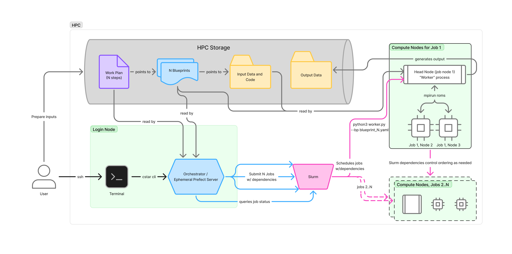

Terminology and Concepts
========================

Definitions
-----------

.. glossary::

    Application
      Something C-Star can run: an ocean model, a data-processing tool, or an
      analysis. Each application declares the blueprint it accepts and knows
      how to turn one into a result. C-Star ships two applications for ocean
      modeling:

      * ``roms_marbl`` runs a UCLA-ROMS simulation, optionally coupled to
        MARBL biogeochemistry.
      * ``forge`` generates a new ROMS-MARBL domain: it produces the input
        files and settings for a simulation and writes the ROMS-MARBL
        blueprint that runs it.

      Smaller applications (``nest_ic``, ``upscaler``, ``plotter``,
      ``hello_world``) support nesting workflows and serve as examples for
      :doc:`writing your own <custom_applications>`.

    Blueprint
      A YAML file holding everything an application needs to produce its
      result. What it contains depends on the application: a ROMS-MARBL
      blueprint names the model code, input files, partitioning and runtime
      settings of one simulation; a forge blueprint describes the domain to
      build. Every blueprint shares a small core (``name``, ``description``,
      ``application``, ``working_dir``) from
      :class:`~cstar.orchestration.models.Blueprint`, and every application's
      blueprint is a subclass of it.

      Blueprints are complete and self-contained. The same blueprint produces
      the same result on any supported machine, and can be checked
      (``cstar blueprint check``) and run (``cstar blueprint run``) from the
      command line. See :doc:`blueprints`.

    ROMS-MARBL blueprint
      The blueprint of the ``roms_marbl`` application: a runnable
      description of one simulation. Forge writes one at the end of domain
      generation; you can also write one by hand for input files you already
      have. See :doc:`blueprints/roms_marbl`.

    Forge
      C-Star's domain-generation application. From a forge blueprint it
      downloads the source datasets, builds the grid and every ROMS input
      file (initial conditions, surface and boundary forcing, tides, rivers,
      optional carbon dioxide removal forcing), renders the model's
      compile-time and run-time settings, and emits the ROMS-MARBL blueprint
      that runs the result. Forge is driven by ``cstar blueprint run`` like
      any other application, with ``cstar forge run`` exposing its extra
      options. See :doc:`forge/index`.

    Forge blueprint
      The blueprint of the ``forge`` application: the single input to domain
      generation. It records the model configuration, grid, forcing
      selections, run window, output settings and resolved model settings
      for one domain, with the values written out in full rather than
      referenced, so it keeps working even if the catalog entries it was
      built from change. Usually written by the wizard. See
      :doc:`blueprints/forge`.

    Spec
      A reusable, named piece of a domain description stored in the catalog.
      Forge composes a forge blueprint from four kinds of spec, and an
      optional fifth:

      * a **ModelSpec** pins the model code (ROMS, MARBL, optionally PIO),
        its render templates, and the model-level default settings;
      * a **DomainSpec** defines a grid: extent, resolution, vertical levels,
        topography source, open boundaries and processor layout;
      * a **ForcingSpec** selects the datasets for initial conditions and
        surface, boundary, tidal and river forcing;
      * an **OutputSpec** chooses which fields the model writes and how
        often;
      * a **CdrSpec** describes optional carbon dioxide removal forcing.

      The wizard presents specs as dropdowns, and can save your own edited
      versions under new names. See :doc:`forge/specs`.

    Catalog
      Where specs and saved blueprints live. A catalog is a stack of plain
      directory trees: the small catalog bundled with C-Star at the bottom,
      optionally a shared group catalog, and your own writable catalog on top
      (``~/cstar/catalog`` by default, or the first entry of
      ``CSTAR_CATALOG``). The wizard reads all layers and writes to yours.
      See :doc:`catalog`.

    Wizard
      Forge's point-and-click interface for building a forge blueprint,
      served as a web page by ``cstar forge wizard`` or opened as a Jupyter
      notebook. It walks through model, domain, forcing, run setup and
      advanced settings, shows the resolved blueprint for review, and saves
      or downloads it. See :doc:`wizard`.

    Workplan
      A YAML file listing one or more **steps** to execute as a unit. Each
      step names an application and a blueprint, and may depend on other
      steps:

      * a step does not start until every step it depends on has completed
        successfully;
      * steps with no unmet dependencies may run at the same time.

      Steps can override values in their blueprint, pass information to one
      another through directives, and consume a blueprint that an earlier
      step generates. See :doc:`workplans`.

    Step
      One unit of work in a workplan: an application, a blueprint, optional
      dependencies, overrides and directives. Each step gets its own
      directory for inputs, logs and output under the run's working
      directory.

    Directive
      A per-step instruction applied on the compute node just before the
      application starts, using information that only exists at run time.
      ``continue-from`` takes a restart file written by an earlier step as
      initial conditions; ``nest-from`` takes a parent run's output as the
      boundary forcing of a nested child. See :doc:`workplans/directives`.

    Orchestrator
      The process that executes a workplan. It builds a graph of the steps
      from their dependencies, submits each step as work becomes available,
      and monitors their status. On an HPC system it runs on a login node and
      submits steps to the job scheduler through a **launcher**; on a laptop
      it runs the steps as local processes. It is ephemeral and can be
      stopped and restarted without loss of state.

    Run ID
      A unique identifier you choose when submitting a workplan
      (``cstar workplan run --run-id <id>``). It names the run's directory,
      lets you check status (``cstar workplan status``) or reattach to a run
      in progress, and lets you re-enter a run to retry failed steps or
      resume them in place. A new run ID starts the workplan from scratch.

    Worker
      The process that executes a single blueprint on a compute resource. It
      reads the blueprint and runs the application exactly as the blueprint
      specifies. Each workplan step, and each ``cstar blueprint run``, is a
      worker.

    Working directory
      Where an application writes its results. A blueprint's ``working_dir``
      names it; a workplan lays out one directory per step under the run's
      directory. On HPC systems default-form working directories are placed
      on the scratch file system. See :doc:`hpc`.

Example HPC deployment
----------------------

The diagram shows a user-initiated workflow on an HPC system. The user has
already prepared a workplan and its blueprints, with the input data on the
cluster's storage (for example by running Forge there first).

The user logs in to a login node and starts the workplan with the ``cstar``
command line. This creates an orchestrator that reads the workplan, works
out which steps can run, prepares each step's blueprint, and submits the
steps to SLURM. SLURM allocates compute resources, enforces the dependencies,
and monitors the jobs. Each step gets its own allocation, in which a worker
reads the step's blueprint and runs the application.

The user can log off and come back later. Calling ``cstar workplan status``
with the same run ID reports how far the workplan has progressed.
