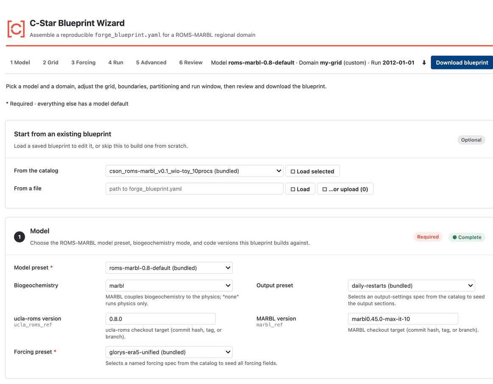
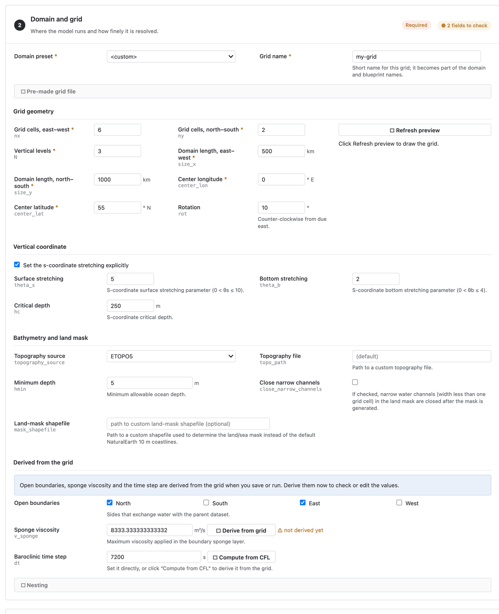
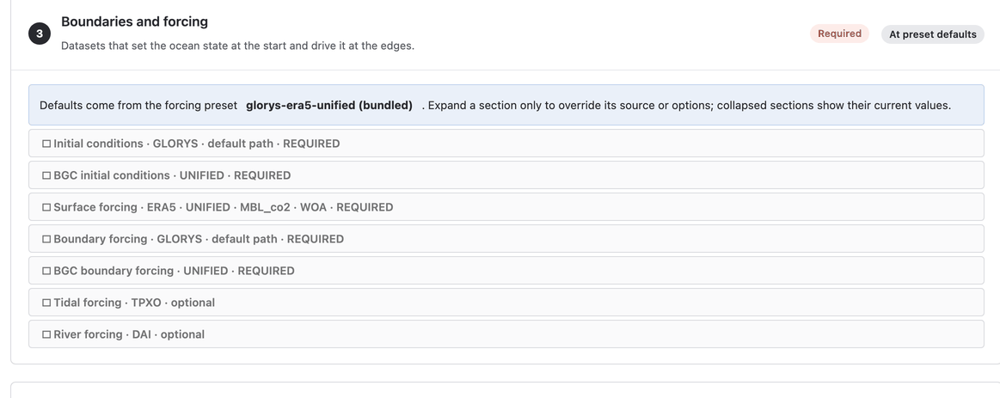
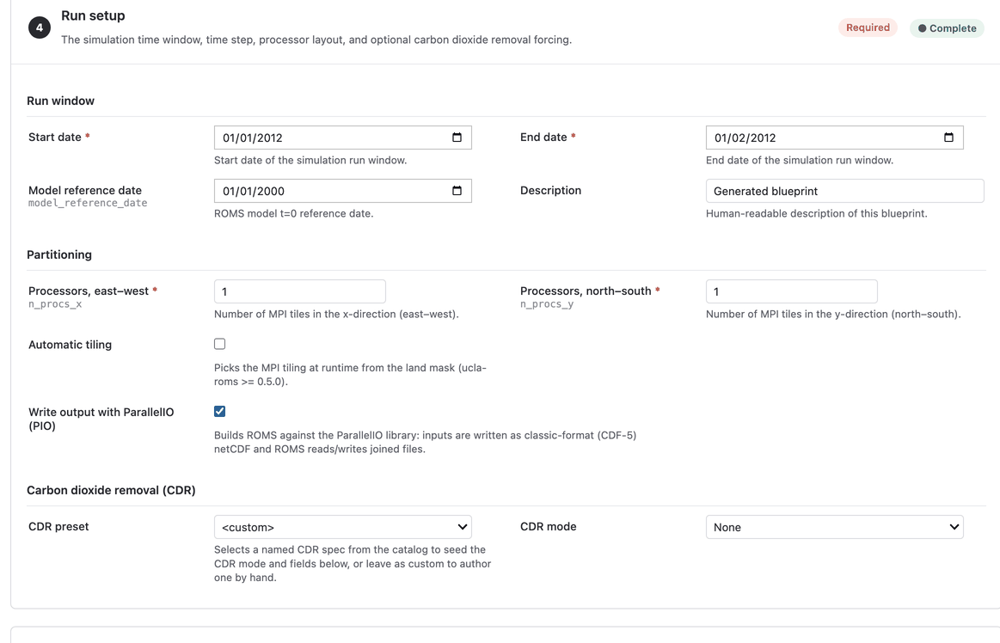
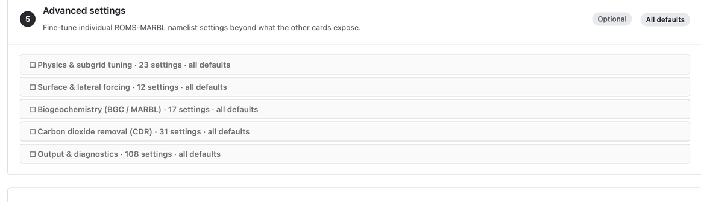
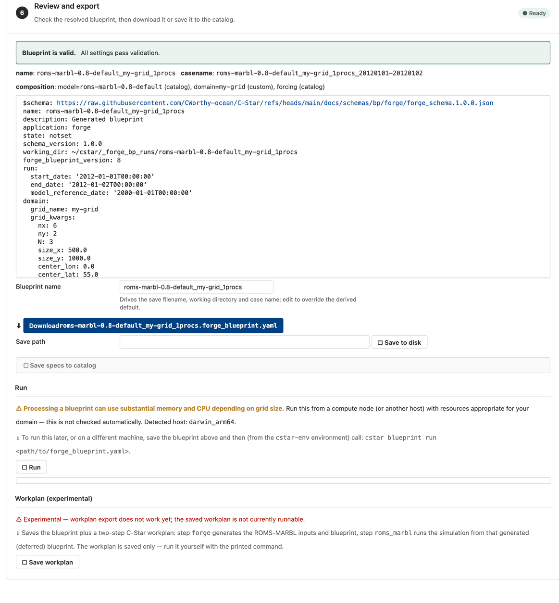

.. _wizard:

The Forge wizard
================

The wizard is Forge's interface for building a :doc:`forge blueprint
<blueprints/forge>` without writing YAML. It presents the choices as a series
of cards, fills each from the catalog, shows the resolved blueprint for review,
and saves or downloads it. The wizard only writes the blueprint; nothing is
downloaded or generated until you run it.

Launching the wizard
--------------------

As a web app
   .. code-block:: console

      cstar forge wizard

   This serves the wizard with `Voila <https://voila.readthedocs.io>`__ at
   ``http://localhost:8866`` and opens it in your browser. ``--port`` picks
   another port; any other options are passed through to Voila, for example
   ``--no-browser`` on a machine without one.

From a login node
   Login nodes have no browser. Serve the wizard there and forward the port
   from your laptop:

   .. code-block:: console

      # on the login node
      cstar forge wizard --no-browser
      # on your laptop
      ssh -N -L 8866:localhost:8866 <user>@<login-node>

   then open ``http://localhost:8866`` locally. Alternatively, build the
   blueprint on your laptop and copy the YAML to the cluster; a forge
   blueprint is portable.

As a Jupyter notebook
   The same wizard is available as a notebook, which is convenient where a
   Jupyter server is already provided, such as an HPC OnDemand portal:

   .. code-block:: console

      cstar forge copy-notebook          # writes ~/cstar/forge-blueprint-wizard.ipynb
      cstar env register-kernel          # once per environment, so Jupyter can find it

   Open the copy in Jupyter and select the registered kernel. Re-run
   ``copy-notebook --force`` after upgrading C-Star to refresh the copy;
   ``--dest`` places it elsewhere. A copy is used rather than the installed
   file because Jupyter saves executed output back into the notebook.

The cards
---------

Cards are worked top to bottom. Required cards are marked; the rest can be
left at their defaults.

Start from an existing blueprint
   Load a blueprint saved in your catalog, or paste YAML, to edit it. Skip
   this card to build one from scratch.

Model
   The model preset (a **ModelSpec** from the catalog), which pins the ROMS,
   MARBL and PIO code versions and the model-level default settings; the
   biogeochemistry mode (MARBL or physics only); and whether to build with
   ParallelIO.

Domain and grid
   Where the model runs and how finely it is resolved. Pick a **DomainSpec**
   from the catalog or edit the grid geometry (extent, resolution, rotation),
   the vertical coordinate, and the bathymetry source and land mask. You can
   attach a pre-made grid file instead of generating one. Open boundaries,
   the sponge viscosity and the time step are derived from the grid unless
   you override them, and an optional nesting section relates this grid to a
   parent or child domain.

Boundaries and forcing
   The datasets that set the ocean state at the start and drive it at the
   edges: a **ForcingSpec** from the catalog, or your own selection of
   initial-condition, surface, boundary, tidal and river sources, with
   biogeochemical sources and the interpolation method for each. Sources
   that you must download yourself (TPXO tides, for example) are noted here;
   see :doc:`data_access`.

Run setup
   The run window (start, end and model reference date), the processor
   layout and PIO or automatic-tiling options, and optional carbon dioxide
   removal forcing, imported from a netCDF file or described by hand.

Advanced settings
   Individual ROMS-MARBL namelist settings beyond what the other cards
   expose, grouped by namelist section (mixing, bottom drag, tides, MARBL,
   each output stream, and so on), plus the compile-time switches. An
   **OutputSpec** from the catalog fills the output sections.

Review and export
   The resolved blueprint as YAML, with validation messages. From here you
   can **Download** the file, **Save** it to your catalog, save any spec you
   modified as a new named catalog entry, run the blueprint through the
   C-Star command line, or save a deferred workplan that runs it later
   (experimental).

Where your work goes
--------------------

Blueprints and workplans you save, and specs you register, land in your own
writable catalog layer, ``~/cstar/catalog`` by default, under ``blueprints/``,
``workplans/`` and one directory per spec kind. The bundled examples stay
visible in the dropdowns, marked ``(bundled)``, and cannot be overwritten:
saving an edited bundled spec means giving it a new name. Set
``CSTAR_CATALOG`` to use another location or to add a shared group catalog.
See :doc:`catalog`.

After saving, process the blueprint with ``cstar blueprint run`` as described
in :doc:`blueprints/forge`.
