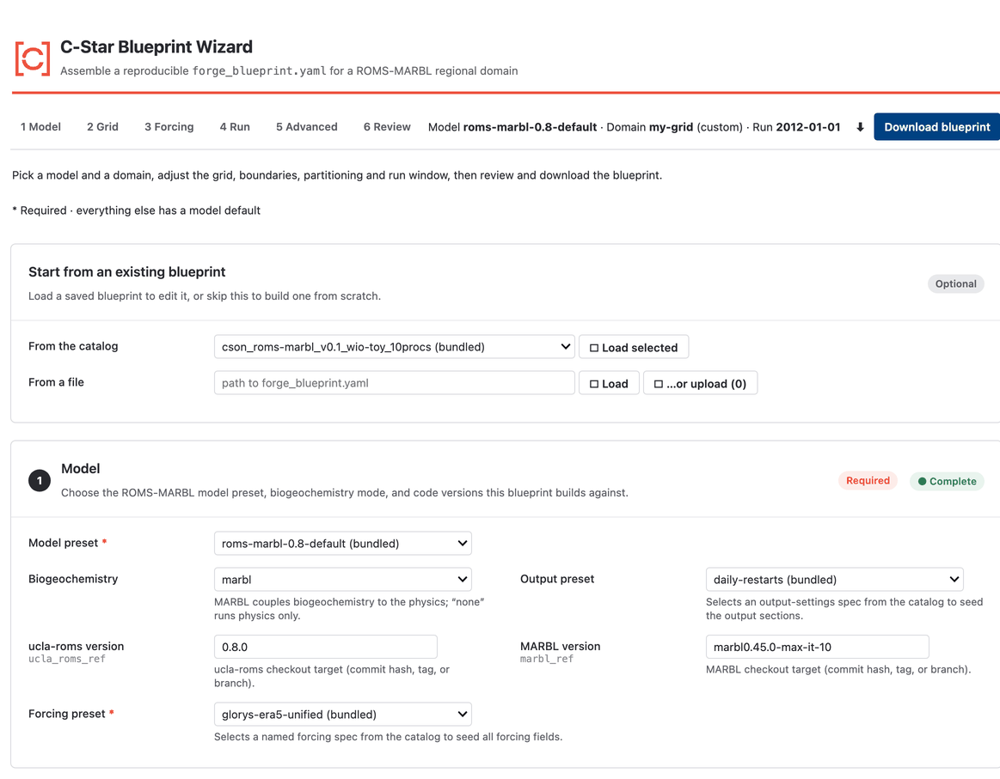
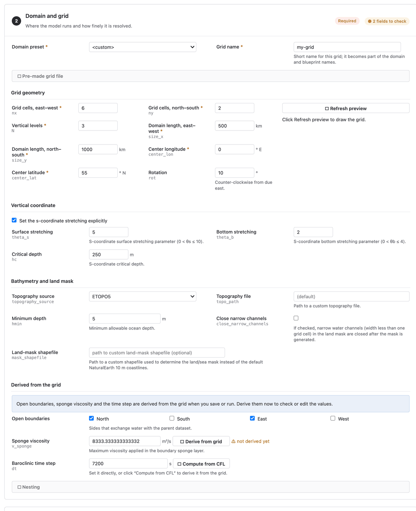
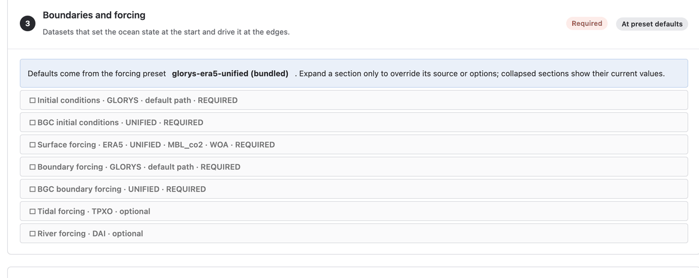
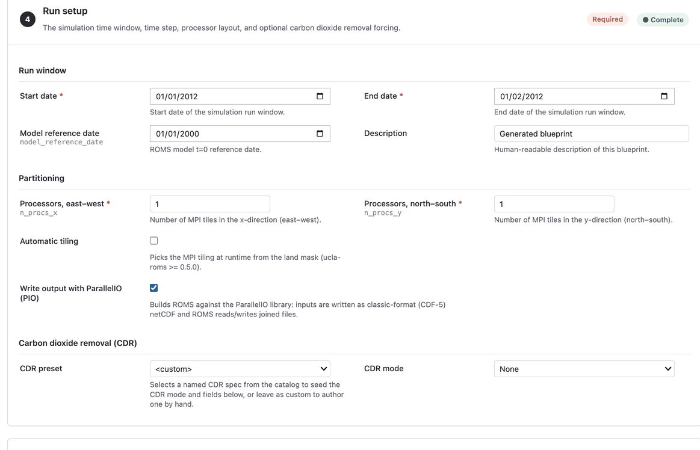
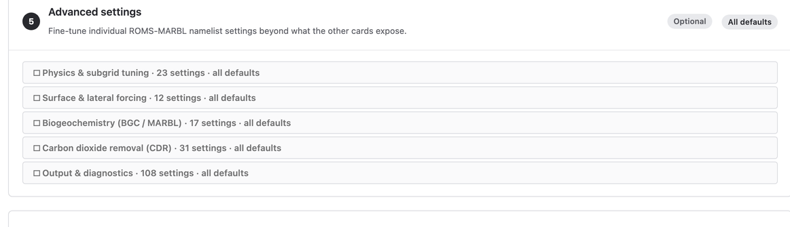
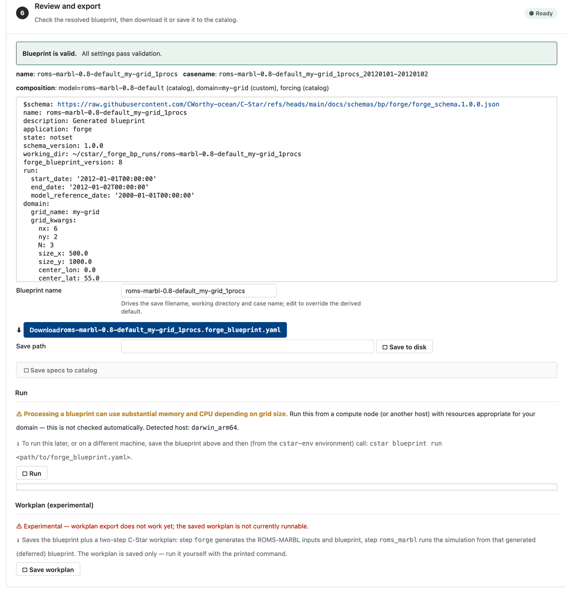

.. _wizard:

The Forge wizard
================

The wizard is Forge's interface for building a :doc:`forge blueprint
<blueprints/forge>` without writing YAML. It presents the choices as a series
of sections, fills each from the catalog, shows the resolved blueprint for review,
and saves or downloads it. The wizard only writes the blueprint; nothing is
downloaded or generated until you run it. The app has two pages, Blueprint
(described here) and Workplan, for composing blueprints into a workplan.

Launching the wizard
--------------------

As a web app
   .. code-block:: console

      cstar wizard

   (``cstar forge wizard`` is equivalent.) This serves the wizard with
   `Voila <https://voila.readthedocs.io>`__ at ``http://localhost:8866`` and
   opens it in your browser. ``--port`` picks another port; any other options
   are passed through to Voila, for example ``--no-browser`` on a machine
   without one.

From a login node
   Login nodes have no browser. Serve the wizard there and forward the port
   from your laptop:

   .. code-block:: console

      # on the login node
      cstar wizard --no-browser
      # on your laptop
      ssh -N -L 8866:localhost:8866 <user>@<login-node>

   then open ``http://localhost:8866`` locally. Alternatively, build the
   blueprint on your laptop and copy the YAML to the cluster; a forge
   blueprint is portable.

As a Jupyter notebook
   The same wizard is available as a notebook, which is convenient where a
   Jupyter server is already provided, such as an HPC OnDemand portal:

   .. code-block:: console

      cstar forge copy-notebook          # writes ~/cstar/forge-blueprint-wizard.ipynb
      cstar env register-kernel          # once per environment, so Jupyter can find it

   Open the copy in Jupyter and select the registered kernel. Re-run
   ``copy-notebook --force`` after upgrading C-Star to refresh the copy;
   ``--dest`` places it elsewhere. A copy is used rather than the installed
   file because Jupyter saves executed output back into the notebook.

The sections
------------

The sections are worked top to bottom. Required sections are marked; the rest
can be left at their defaults.

Start from an existing blueprint
   Load a blueprint saved in your catalog, or paste YAML, to edit it. Skip
   this section to build one from scratch.

Model
   The model preset (a **ModelSpec** from the catalog), which pins the ROMS,
   MARBL and PIO code versions and the model-level default settings; the
   biogeochemistry mode (MARBL, physics only, or CDR-lite without MARBL);
   and whether to build with ParallelIO.

   The ``cdr_lite`` mode (ucla-roms 0.10.0 or later) builds ucla-roms' CDR-lite
   tracers without MARBL, so the blueprint carries no biogeochemical forcing.
   It needs a CDR forcing: the CDR panel in Run setup shows a reminder, and a
   simple-mode forcing then builds one ALK (OAE) release, while a YAML or
   netCDF forcing must use ``tracer_set: cdr_lite``. The mode also reads the
   carbonate sensitivities (``ddic_dco2`` and ``ddic_dalk``) from files, so a
   **Carbonate sensitivities** group appears below the mode. By default it is
   left to the ``carbonate-sensitivity-from`` workplan directive, which
   supplies the ``_cdrgas`` output of an earlier ROMS-MARBL step when the
   workplan runs. Choose *Directory of ROMS _cdrgas files* instead to attach
   the files now: the wizard lists the joined files in the directory (the
   per-rank tiles are skipped), checks they are netCDF, hashes them and records
   them on the blueprint. With ParallelIO on, Forge converts any file that is
   not classic netCDF to CDF-5 when it stages the copies.

Domain and grid
   Where the model runs and how finely it is resolved. Pick a **DomainSpec**
   from the catalog or edit the grid geometry (extent, resolution, rotation),
   the vertical coordinate, and the bathymetry source and land mask. You can
   attach a pre-made grid file instead of generating one. Open boundaries,
   the sponge viscosity and the time step are derived from the grid unless
   you override them, and an optional nesting section relates this grid to a
   parent or child domain.

Boundaries and forcing
   The datasets that set the ocean state at the start and drive it at the
   edges: a **ForcingSpec** from the catalog, or your own selection of
   initial-condition, surface, boundary, tidal and river sources, with
   biogeochemical sources and the interpolation method for each. Sources
   that you must download yourself (TPXO tides, for example) are noted here;
   see :doc:`data_access`.

Run setup
   The run window (start, end and model reference date), the processor
   layout and PIO or automatic-tiling options, and optional carbon dioxide
   removal forcing, imported from a netCDF file or described by hand (required
   in ``cdr_lite`` mode).

Advanced settings
   Individual ROMS-MARBL namelist settings beyond what the other sections
   expose, grouped by namelist section (mixing, bottom drag, tides, MARBL,
   each output stream, and so on), plus the compile-time switches. An
   **OutputSpec** from the catalog fills the output sections.

Review and export
   The resolved blueprint as YAML, with validation messages. From here you
   can **Download** the file, **Save** it to your catalog, save any spec you
   modified as a new named catalog entry, or run the blueprint through the
   C-Star command line. To run this blueprint as part of a workplan, build
   one on the Workplan page. **Run** executes ``cstar blueprint run`` on the
   machine the wizard is running on, so on a cluster's login node use it only
   for toy domains; for real domains save the blueprint and submit it through a
   workplan or from a compute node (see :doc:`hpc`).

The Workplan page
-----------------

The second page builds a :doc:`workplan <workplans>`: it composes steps into
a DAG, validates the draft as you edit, and saves, checks and runs it. It works
like the Blueprint page: a sticky bar shows whether the draft is valid, and
each card carries a status chip. Every edit regathers the draft and validates
it with the same model ``cstar workplan check`` loads, so a problem listed in
the Review card is one the command line would report.

On a wide screen the page has two columns. The cards described below are on
the left; on the right, kept in view while you scroll, is a live picture of
what you are building, switchable between **YAML**, **DAG** and both. The YAML
is editable: change it and press **Apply edits** to load the text back into
the page (errors are listed and nothing changes; **Discard edits** restores the
draft's text). The DAG draws the steps left to right by dependency, with steps
of other runs as dashed grey source nodes and each node coloured by
application. Edges that come from a restart (``continue-from``), boundary
(``nest-from``), carbonate sensitivity (``carbonate-sensitivity-from``) or
deferred blueprint reference are labelled as such. The graph follows your edits
even while the draft is invalid. On a narrow screen the columns stack.

The **Preview** control at the top of that pane moves it: **Right** (the
default) is the two columns, **Bottom** puts the pane below the cards and
**Top** directly under the status bar, with the YAML and the graph side by
side, and **Hidden** leaves only the control strip so the pane can be brought
back. **Keep preview visible** (on by default) makes the pane stick to the page
while you scroll, so the YAML and graph stay in view as the cards move
beneath them; turn it off and the pane scrolls away with the page. The choice
is kept for the open page only.

Start
   Begin a new workplan, or load one from the catalog's ``workplans/``
   directory, from a path, or by upload. Loading rewrites deprecated and
   path-based spellings (``rst_path`` and ``bry_path`` directive keys, the
   legacy ``joined_output`` directory, a blueprint file that adds nothing to
   its step's overrides) and lists every rewrite in the Review card. The file
   you loaded is never written unless you confirm an overwrite when saving.

Workplan
   The name, description (the name when left blank) and runtime variables, and
   the **runs** table, "Add aliases to previous run-ids". Each
   row binds an alias to the run-id of another workplan run that this one
   refers to as ``step@alias``. Pick a run recorded on this machine with
   **Refresh runs**, type a run-id, or enter a ``{{variable}}`` for a template
   workplan. A picked run offers its steps in every step picker and shows
   each step's recorded status; a step that is not finished is flagged, since
   the run may complete first. When no record is visible here (authoring on a
   laptop for a cluster), type the step names instead; they are checked when
   the workplan is scheduled.

Compute target
   **Local**, **SLURM**, or **Not specified**, which leaves the choice to the
   environment when the workplan runs. A SLURM target names a machine (the
   systems C-Star supports through SLURM, or a custom one), its queue, the
   account and a default walltime; these are written to the workplan's
   ``compute_environment`` block (see :doc:`workplans`) and a step's own
   compute overrides win. A custom machine also takes the CPUs per node.
   Blank fields fall back to the ``CSTAR_SLURM_*`` environment settings, shown
   in grey. On a supported machine the page preselects it.

Recipes
   Generators for the recurring shapes, one collapsed panel each. Each adds
   ordinary steps to the Steps card below, which you can keep editing. The
   chunk and ramp recipes start from an existing roms_marbl step, a catalog
   or path blueprint (turned into a base step for you), or a forge
   blueprint (which adds the forge step and chunks the roms_marbl step it
   generates); an existing base step stays in the workplan, so delete it if
   it should not run. **Chunk a run in time** splits a roms_marbl run into
   chained steps by calendar month, fixed days or equal parts, each writing
   only its end date and continuing from the previous restart; the first can
   continue from a step, a step of another run or a path, and the walltime
   can be fixed or scaled by the chunk length. **Spin-up ramp** chains short
   segments with a growing time step. **Forge inputs, then run** adds a forge
   step and the deferred roms_marbl step that runs what it generates.
   **Upscale a nested run** adds, for each pair of nested levels, an upscaler
   step and a re-run of the parent that uses its output; levels must not be
   time chunks. A generator that cannot proceed explains why in the card.

Steps
   One collapsible pane per step, with buttons to duplicate, delete and move
   it. A pane holds:

   * the **blueprint**: a catalog roms_marbl or forge blueprint, a path, an
     upload, the configuration currently on the Blueprint page, a **deferred**
     blueprint generated by an upstream step (the filename and CPU count are
     prefilled from the forge blueprint that produces it), or an **inline**
     blueprint with no file. The application is read from a blueprint file
     and chosen explicitly for deferred and inline blueprints;
   * **depends on**: the steps it waits for. Dependencies implied by a
     directive, a ``{{input_dir: step}}`` placeholder or a deferred blueprint
     are added for you and listed beside the field;
   * **blueprint overrides**: for roms_marbl the end date (the start comes
     from the blueprint or from the restart a directive finds), a table of
     namelist settings with typed fields for the blueprint's ucla-roms
     version, a CDR forcing file, and the ucla-roms branch or commit. For the
     small applications (``nest_ic``, ``upscaler``, ``hello_world``) the form
     is generated from the application's blueprint fields, required fields
     marked, with a picker that inserts a placeholder naming another step's
     input or output directory. A YAML box merges any other override last;
   * **directives** for roms_marbl: where the step continues from (a step, a
     step of another run, or a path, with an optional restart timestamp
     chosen from the restarts found there when they can be read), the
     ordered boundary sources for a nested child, and the ordered carbonate
     sensitivity sources for a CDR-LiTE run (steps or paths, as for the
     boundaries; a source step must be a ROMS-MARBL run with the gas-exchange
     output on);
   * **compute overrides**: CPUs (prefilled from the blueprint, and required
     for a deferred blueprint, which the launcher cannot read), walltime,
     queue, account and CPUs per node. Blank values inherit the compute
     target.

   Run-entry controls (``clobber``, ``resume``, ``pre_run``) and the working
   directory are not part of a step as authored and are never shown.

Review and run
   Validation, the list of changes made on load, and the save, download and
   run controls. **Save** writes the applied draft, never unapplied text, to
   the catalog's ``workplans/`` directory by default, and there is a download
   link. Saving over the file you loaded takes a second click on **Confirm
   overwrite**. **Deep check** resolves the draft as running it
   would, in this session, listing every problem; blueprints or run records
   that cannot be read on this machine are reported as not verifiable here
   rather than as errors. A readiness list shows which steps a pre-run would
   prepare and which it would skip, and why. **Check** and **Run** save the
   draft if needed and stream ``cstar workplan check`` and ``cstar workplan
   run`` into the page. On a SLURM target with at least one preparable step,
   **Pre-run first** is on by default: it prepares those steps on this
   machine, then shows the command that submits the same run-id. After a run
   the page names ``cstar workplan status <run-id>``. Run returns once the
   workplan is scheduled; on a cluster's login node that only submits jobs.

Where your work goes
--------------------

Blueprints and workplans you save, and specs you register, land in your own
writable catalog layer, ``~/cstar/catalog`` by default: blueprints under
``blueprints/forge/``, workplans under ``workplans/``, and specs in one
directory per spec kind. The bundled examples stay
visible in the dropdowns, marked ``(bundled)``, and cannot be overwritten:
saving an edited bundled spec means giving it a new name. Set
``CSTAR_CATALOG`` to use another location or to add a shared group catalog.
See :doc:`catalog`.

After saving, process the blueprint with ``cstar blueprint run`` as described
in :doc:`blueprints/forge`.
